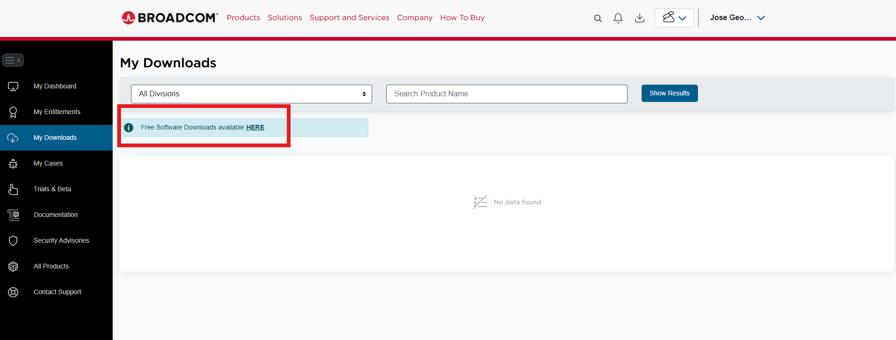
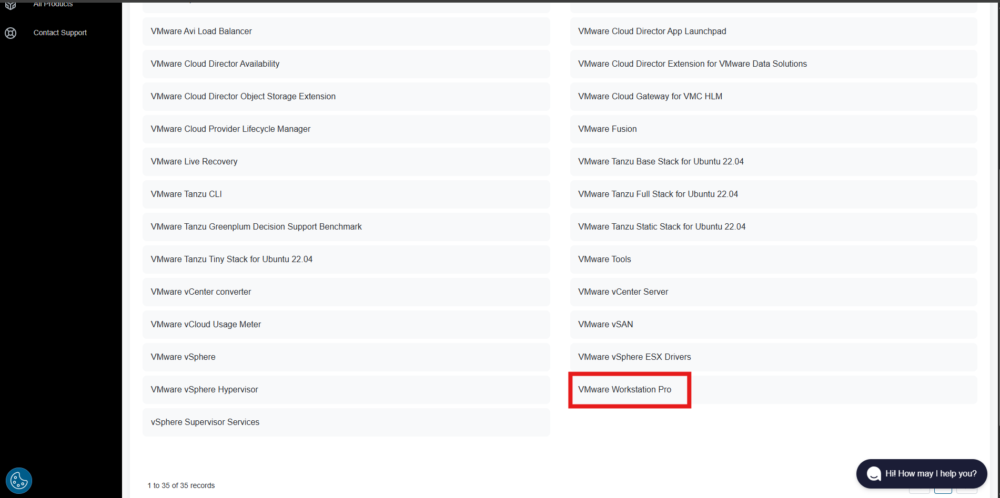
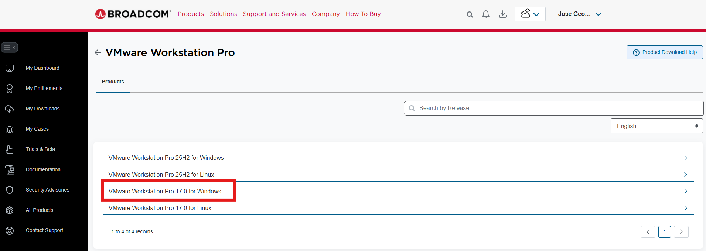
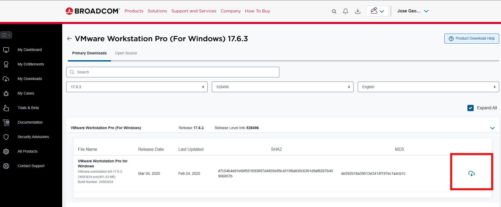
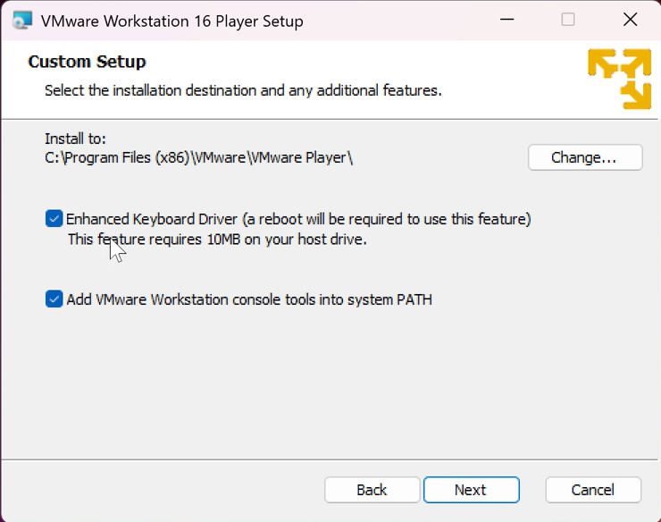

# Install VMware Workstation

## Objective
The objective of this step is to install VMware Workstation on the host machine to prepare the virtualization environment for the Wazuh lab.

VMware Workstation will be used to create and run the virtual machines required for the project, starting with the Ubuntu server where Wazuh will be installed.

## Installation Steps
1. Download the VMware Workstation installer from the official website:
Here is the link, but first you need to create an account in BROADCOM:
https://support.broadcom.com/

2. Once you create the account and sign in, go to the following sections: enter My Downloads, then click the option Free Software Downloads Available HERE.

3. After that, scroll down and select VMware Workstation Pro, then choose VMware Workstation Pro 17.0 for Windows, or if you use Linux, choose Linux,  and select a version that is not the newest one.

4. Finally, click Download, If a form appears when you click download, just fill it out and click accept or save (I don’t remember exactly which one). After that, it will take you back to the same page, and you can simply click download again

5. Locate the installer file on the host machine.
6. Right-click the installer and select **Run as administrator**.
7. Click **Next** to begin the installation.
8. Accept the license agreement.
9. Select the option: **Add VMWare Wrokstation Console Tools into system PATH**

10. Continue with the default settings.
11. Click **Install** to start the installation process.
12. Click **Finish** when the setup is done.
13. Restart the host machine if required.
14. Open VMware Workstation and confirm it starts correctly.

---

<table>
  <tr>
    <td align="left">
      ⬅️ <a href="01-Lab_Overview.md">Previous Step: Lab Overview</a>
    </td>
    <td align="right">
      <a href="03-Create-Ubuntu-VM.md">Next Step: Create Ubuntu Virtual Machine</a> ➡️
    </td>
  </tr>
</table>
