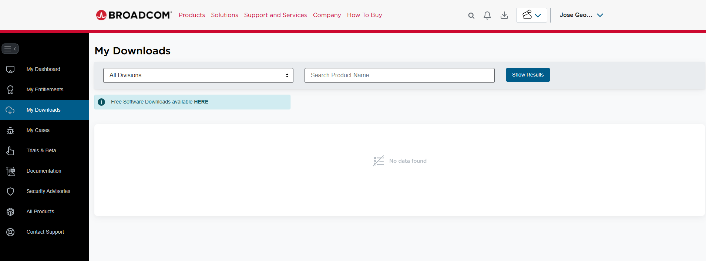

# Install VMware Workstation

## Objective
The objective of this step is to install VMware Workstation on the host machine to prepare the virtualization environment for the Wazuh lab.

VMware Workstation will be used to create and run the virtual machines required for the project, starting with the Ubuntu server where Wazuh will be installed.

## Installation Steps
1. Download the VMware Workstation installer from the official website:
Here is the link, but first you need to create an account in BROADCOM:
https://access.broadcom.com/default/ui/v1/signin/

2. Once you create the account and sign in, go to the following sections: enter My Downloads, then click the option Free Software Downloads Available HERE.

3. After that, scroll down and select VMware Workstation Pro, then choose VMware Workstation Pro 17.0 for Windows, and select a version that is not the newest one.

4. Finally, click Download.

5. Locate the installer file on the host machine.
6. Right-click the installer and select **Run as administrator**.
7. Wait for the setup wizard to open.
8. Click **Next** to begin the installation.
9. Accept the license agreement.
10. Select the standard installation option.
11. Continue with the default settings.
12. Click **Install** to start the installation process.
13. Wait for the installation to complete.
14. Click **Finish** when the setup is done.
15. Restart the host machine if required.
16. Open VMware Workstation and confirm it starts correctly.

