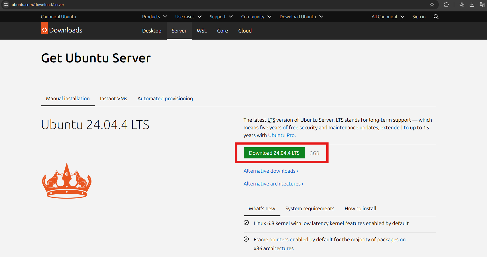
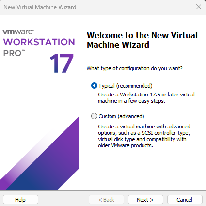
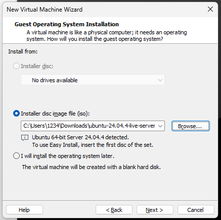
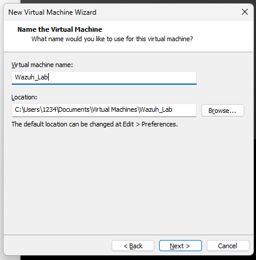
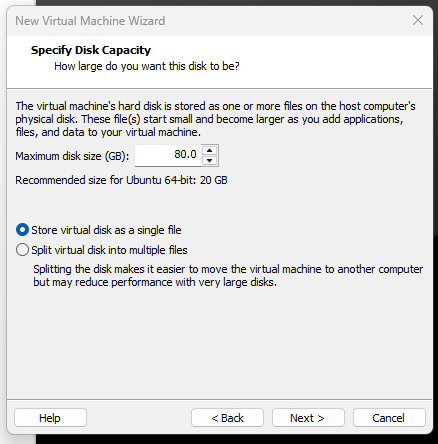
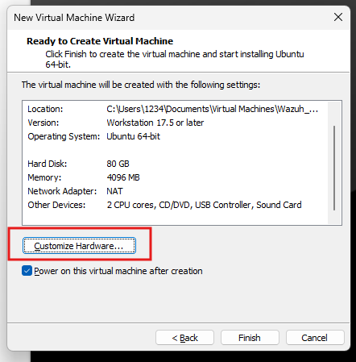
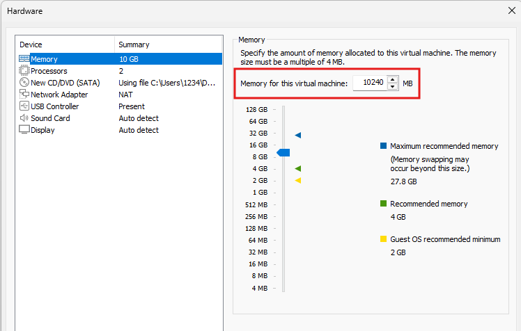
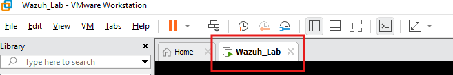

# Create Ubuntu Virtual Machine

## Objective
The objective of this step is to create the virtual machine that will host the Wazuh server in the lab environment.

This virtual machine will be prepared in VMware Workstation and configured with the resources required for a small all-in-one Wazuh lab.

## **Steps**
# Ubuntu Server Installation for the Wazuh Lab

The first step is to install the operating system. For this lab, we will use **Ubuntu Server 22.04 LTS**, since it is a stable and compatible option for deploying **Wazuh All-in-One**, which includes the **Manager**, **Indexer**, and **Dashboard**.

### 1. Download Ubuntu Server
Go to the following link and download the Ubuntu Server ISO image:
https://ubuntu.com/download/server

### 2. Create a New Virtual Machine
Open **VMware**, then go to:
**File > New Virtual Machine**

### 3. Initial Setup
The virtual machine creation wizard will open.  
The layout may look slightly different depending on the VMware version you are using, but the process is basically the same.

### 4. Choose the Configuration Type
Select the option:
**Typical (recommended)**
Then click **Next**.

### 5. Select the ISO Image
In the next section, select:
**Installer disc image file (ISO)**
Then browse and choose the Ubuntu Server ISO file you downloaded earlier.

### 6. Name the Virtual Machine
Assign a name to the virtual machine. For example:
`Wazuh_Lab`

### 7. Configure Disk Size
In this section, configure the virtual disk size.
- **Recommended:** 80 GB  
- **Minimum recommended:** 50 GB  
For this lab, **80 GB is recommended** to have enough space for logs, packages, and future testing.

Also, select the option:
**Store virtual disk as a single file**

### 8. Configure Hardware Resources
Before finishing, adjust the hardware settings, especially the RAM.
- **Recommended RAM:** 12 GB  
- **Minimum recommended RAM:** 8 GB  

For example, in this lab you can assign **10 GB of RAM** if your physical machine supports it.

### 9. Finish the Virtual Machine Creation
Once everything is configured, click **Finish**.

## 10. Power Off the Virtual Machine
After clicking **Finish**, the virtual machine may start automatically.  
Shut it down before continuing with the Ubuntu installation.

To do this:

- Right-click inside the VM window
- Select **Shutdown**

### Summary
At this point, the virtual machine is ready for the Ubuntu Server installation.

### Recommended settings for this lab
- **Operating System:** Ubuntu Server 22.04 LTS
- **Deployment type:** Wazuh All-in-One
- **CPU:** 4 vCPU
- **RAM:** 10 GB to 12 GB
- **Disk:** 80 GB

### Minimum recommended settings
- **CPU:** 4 vCPU
- **RAM:** 8 GB
- **Disk:** 50 GB
