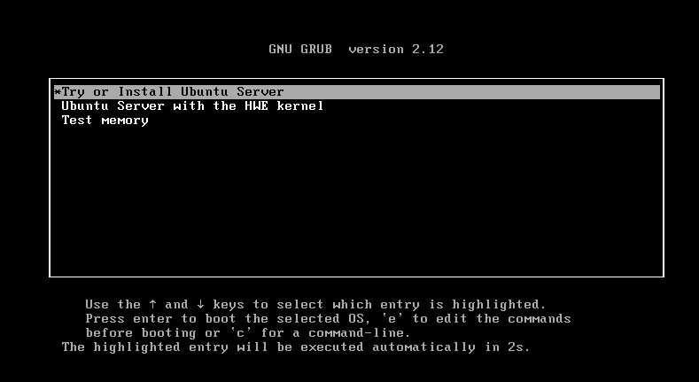

## Ubuntu Server Installation in VMWare

Follow these steps to install Ubuntu Server inside your virtual machine:

---

### 1. Start Installation

The VM will boot automatically.  
Press **Enter** on **"Try or Install Ubuntu Server"** and wait.

---

### 2. Select Language

Choose your preferred language.  
For this lab, we will use:

- **English**

---

### 3. Installer Update

Since the VM has internet access, you will see an option to update the installer.

- Select: **Update to the new installer** (recommended)  
- You can also skip this step without issues

---

### 4. Keyboard Configuration

Select your keyboard layout.

- Recommended: **English (US)**

---

### 5. Installation Type

Leave the default settings and select:

- **Done**

---

### 6. Network Configuration

Leave the default network configuration.

- We will modify this later for lab purposes

Select **Done**.

---

### 7. Proxy Configuration

Do not configure any proxy.

- Leave it empty
- Select **Done**

---

### 8. Mirror Configuration

Wait for the mirror test to complete.

- Once finished, select **Done**

---

### 9. Storage Configuration (Step 1)

Leave the default configuration:

- **Use entire disk**
- **LVM enabled**
- **No encryption**

Select **Done**.

---

### 10. Storage Configuration (Step 2)

No changes are required.

- Select **Done**

---

### 11. Confirm Changes

You will be asked to confirm disk changes.

- Select **Continue**

---

### 12. User Setup

Configure the following:

- Server name  
- Username  
- Password  

Then select **Done**.

---

### 13. Ubuntu Pro

Skip this step.

- Leave it as default
- Select **Continue**

---

### 14. OpenSSH Setup

Enable SSH access:

- Press **Enter** to select **Install OpenSSH server**
- Then select **Done**

This is important for remote access to your lab.

---

### 15. Featured Server Snaps

Leave this section as default.

- Select **Done**

---

### 16. Installation Process

Wait for the installation to complete.  
This may take several minutes.

Once finished:

- Select **Reboot Now**
- Press **Enter** if prompted

---

### 17. Login

After reboot:

- Enter your **username**
- Enter your **password**

---

✅ Ubuntu Server is now successfully installed and ready for the next steps.
