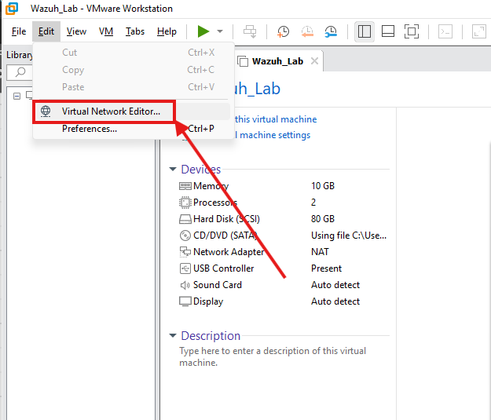
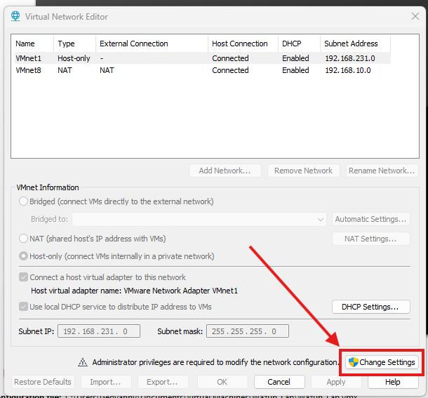
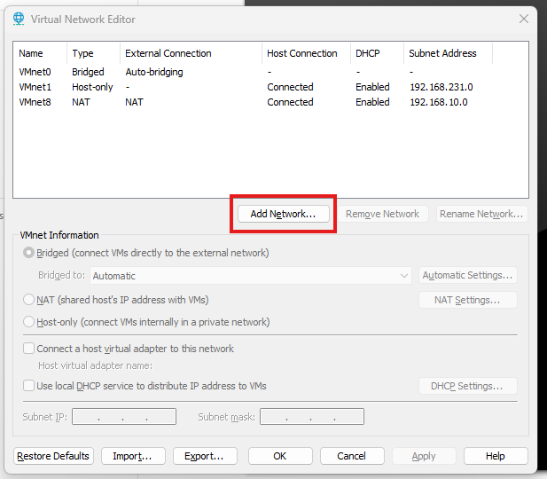
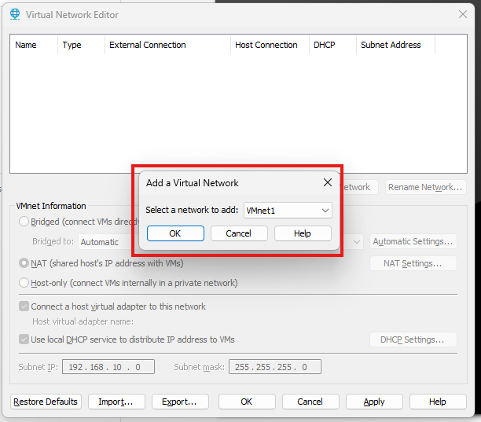
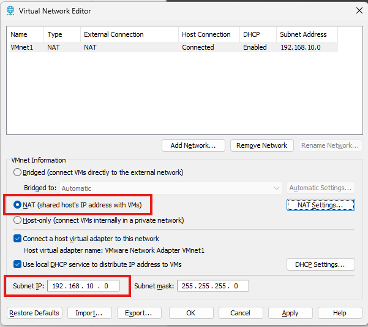
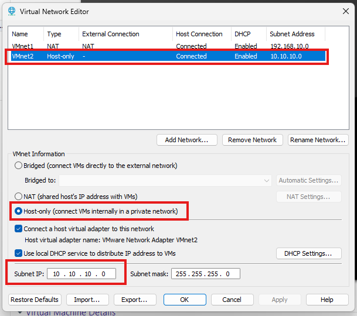
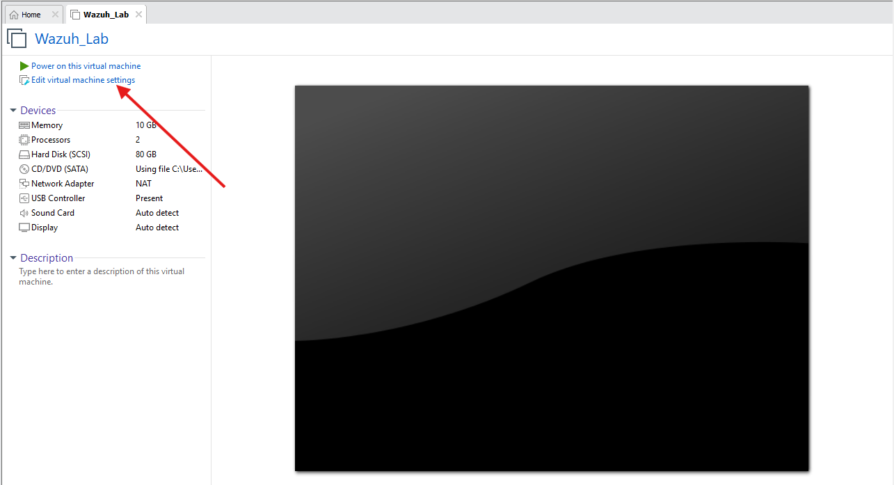
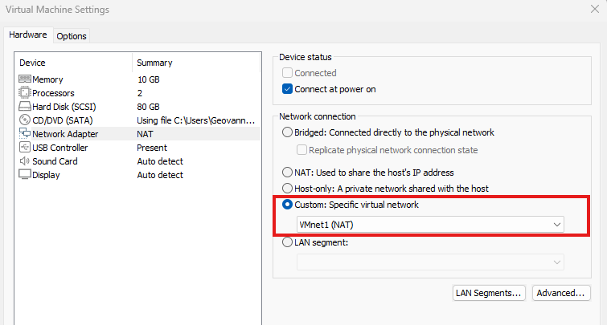
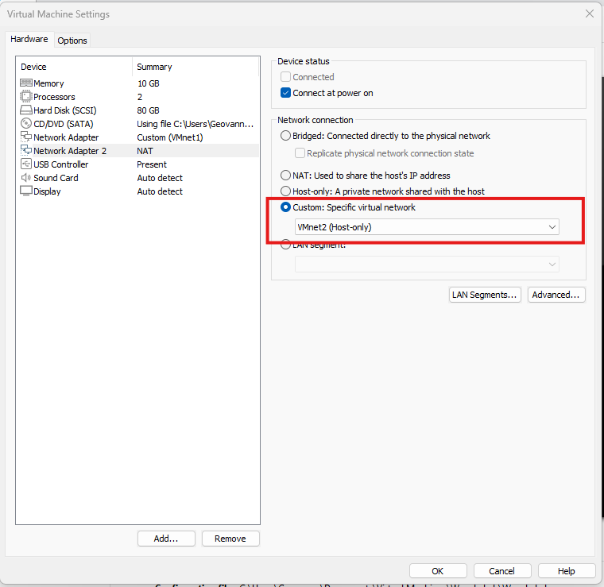

## Configure the Wazuh Lab Network in VMware Workstation

In this section, I will prepare the virtual network layout for the Wazuh lab in VMware Workstation. The goal is to create one network with internet access using NAT and a second internal network using Host-Only, so the lab feels more realistic and gives better control over how the virtual machines communicate.

### Step 1 - Open the Virtual Network Editor

First, open VMware Workstation, click **Edit**, and then select **Virtual Network Editor**.



### Step 2 - Enable Administrative Changes

Once the Virtual Network Editor opens, click **Change Settings** and confirm with **Yes** so VMware allows you to modify the virtual networks.



### Step 3 - Remove Existing VMnet Networks (Optional)

At this point, I remove the existing VMnet networks by selecting them and clicking **Remove Network**. This step is optional, but I like doing it so I can start with a cleaner setup and clearly understand how my lab networks are structured.


### Step 4 - Add the First Virtual Network

Next, click **Add Network** and choose any available VMnet **except VMnet0**. I avoid VMnet0 because it is usually reserved for **Bridged** mode, which connects the VM directly to the real physical network.



### Step 5 - Confirm the New VMnet

After selecting the VMnet, click **OK** to create it.



### Step 6 - Configure the NAT Network

Now configure this first network as **NAT**. For the **Subnet IP**, use **192.168.10.0** like in the example, or choose another subnet if you prefer. Once everything looks correct, click **Apply** and then **OK**.



### Step 7 - Create the Internal Host-Only Network

Repeat the same process to create a second VMnet. This time, configure it as **Host-Only** so it works as an internal lab network. For this network, use the **10.10.10.0** subnet with the mask **255.255.255.0**.



### Step 8 - Open the Wazuh VM Hardware Settings

With the **Wazuh VM powered off**, click **Edit virtual machine settings** and go to the current **Network Adapter** configuration.



### Step 9 - Assign the First Adapter to VMnet1

In the network settings, select **Custom: Specific virtual network**, choose **VMnet1 (NAT)**, and click **OK**. This adapter will provide internet access to the Wazuh VM.




### Step 10 - Add a Second Network Adapter

Go back again to **Edit virtual machine settings**, click **Add**, select **Network Adapter**, and then click **Finish**.


### Step 11 - Assign the Second Adapter to VMnet2

Open the new **Network Adapter 2**, select **Custom: Specific virtual network**, choose **VMnet2 (Host-Only)**, and click **OK**. This second adapter will be used for the internal lab communication.



### Step 12 - Power On the Wazuh VM and Update the System

Finally, power on the Wazuh VM, sign in with your credentials, and run the following command to update the Ubuntu system packages. Since the command uses `sudo`, the system will ask for your password. Then just wait for the update process to finish.

```bash
sudo apt update && sudo apt upgrade -y
