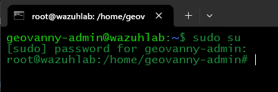

## Install Wazuh All-in-One and Access the Dashboard

In this section, I will install **Wazuh All-in-One** on a single Ubuntu server. This is a good option for a lab because it keeps everything on one machine, making the setup easier and faster to understand.

Wazuh is an open-source security platform used to collect logs, detect suspicious activity, and monitor systems from one place. Its architecture is simple once you break it down: the **Manager** is the part that receives and analyzes events, the **Indexer** is the component that stores and searches the data, and the **Dashboard** is the web interface where we view alerts, search logs, and manage the platform.

### Step 1 - Open the Wazuh Quick Start page

First, open the official Wazuh Quick Start page. This is the guide I will use to install Wazuh in the lab:
https://documentation.wazuh.com/current/quickstart.html

### Step 2 - Power on the VM and identify its IP address

Now power on the Wazuh VM and log in locally. Once inside the VM, run the following command to identify its IP address:

~~~bash
ip addr
~~~

In my case, the IP address of the Wazuh VM is `192.168.10.128`.

### Step 3 - Connect to the Wazuh VM through SSH

After identifying the IP address, open a **CMD window on the Windows host** and connect to the VM through SSH using the username and IP address:

~~~bash
ssh geovanny-admin@192.168.10.128
~~~

The first time you connect, SSH will ask if you want to trust the host. Type `yes`, then enter the password of the Wazuh VM user.

I prefer using SSH here because it makes it much easier to copy and paste the installation commands from the Wazuh documentation into the server.

### Step 4 - Switch to the root user

Once connected through SSH, switch to the root user so you can run the installation commands with the required privileges:

~~~bash
sudo su
~~~

Then enter the password of the Wazuh VM user.

### Step 5 - Run the Wazuh installation command

Now copy the installation command shown on the Wazuh Quick Start page and run it inside the SSH session:

~~~bash
curl -sO https://packages.wazuh.com/4.14/wazuh-install.sh && sudo bash ./wazuh-install.sh -a
~~~

This process may take several minutes because Wazuh will install the **Indexer**, **Dashboard**, and **Manager** on the same server.

### Step 6 - Save the Dashboard credentials

When the installation finishes, Wazuh will display a summary with the web access information, including the username and password for the Dashboard. Save these credentials because they will be needed later to log in.

This final output also confirms that the installation was completed successfully.

### Step 7 - Verify that all Wazuh services are running

To make sure everything started correctly, check the status of each main component from the Wazuh VM while still using the root user.

The **Dashboard** is the web interface.  
The **Indexer** stores and searches the alerts and logs.  
The **Manager** receives the events, analyzes them, and generates alerts.

Run the following commands one by one:

~~~bash
systemctl status wazuh-dashboard
systemctl status wazuh-indexer
systemctl status wazuh-manager
~~~

Each service should appear as **active (running)**. To exit the status screen, press `Ctrl + C`.

If any service is not running, start it manually with:

~~~bash
systemctl start wazuh-dashboard
systemctl start wazuh-indexer
systemctl start wazuh-manager
~~~

### Step 8 - Open the Wazuh web interface

After confirming that all services are running, open your preferred browser on your host machine and browse to the IP address of the Wazuh VM using HTTPS:

`https://192.168.10.128`

Because this is a lab environment and Wazuh uses a self-signed certificate by default, the browser will likely show a security warning. Click **Advanced** and then continue to the site.

### Step 9 - Open the login page

After bypassing the browser warning, the Wazuh login page should appear. This means the Dashboard is reachable and ready to use.

### Step 10 - Recover the credentials if needed

If you did not save the credentials shown at the end of the installation, you can display them again by running the following command inside the Wazuh VM:

~~~bash
sudo tar -O -xvf wazuh-install-files.tar wazuh-install-files/wazuh-passwords.txt
~~~

This command shows all the credentials created during the installation. For the Dashboard login, use the first entry labeled:

`Admin user for the web user interface and Wazuh indexer`

That is the account used to sign in to the Wazuh Dashboard.

### Step 11 - Log in to the Wazuh Dashboard

Finally, enter the username and password and log in to the Wazuh Dashboard.

If the page does not load, or if the login page does not appear, check again that these three services are running:

~~~bash
systemctl status wazuh-dashboard
systemctl status wazuh-indexer
systemctl status wazuh-manager
~~~

If any of them is stopped, start it with:

~~~bash
systemctl start wazuh-dashboard
systemctl start wazuh-indexer
systemctl start wazuh-manager
~~~

You can run these commands either with `sudo` or while already logged in as `root`.

---

  <strong>Lab Navigation</strong>

  <a href="05-Configuration-Ubuntu-Before-Install-Wazuh.md">⬅️ Previous Step: Configure Ubuntu Before Installing Wazuh</a>
  &nbsp;&nbsp;&nbsp;|&nbsp;&nbsp;&nbsp;
  <a href="07-Windows_Server_2022.md">Next Step: Install Windows Server 2022 ➡️</a>

