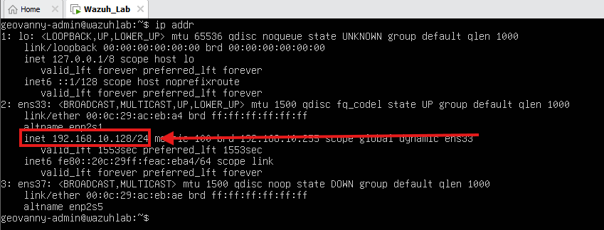
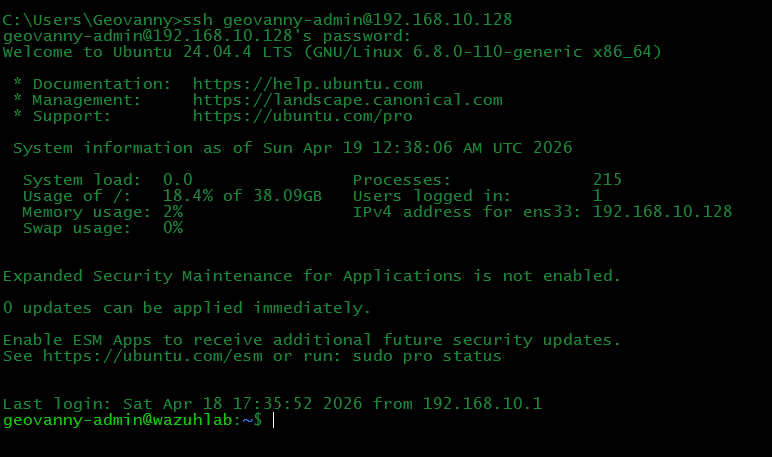
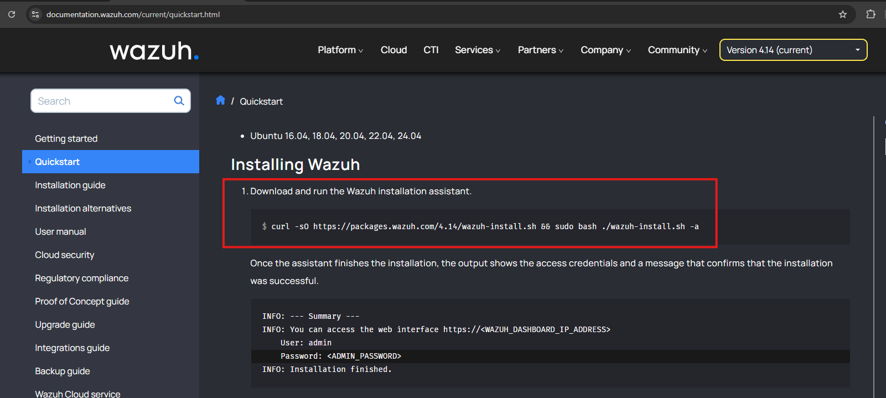
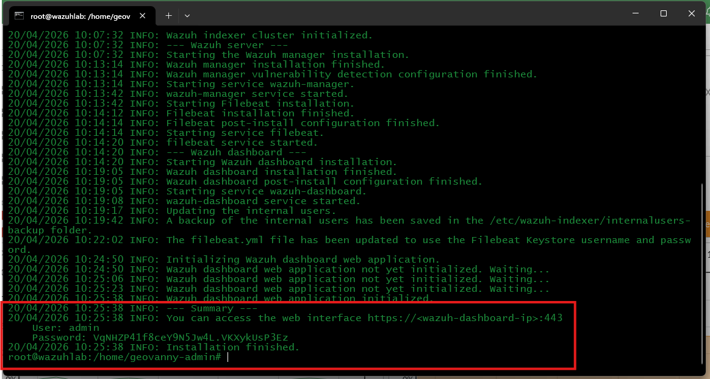
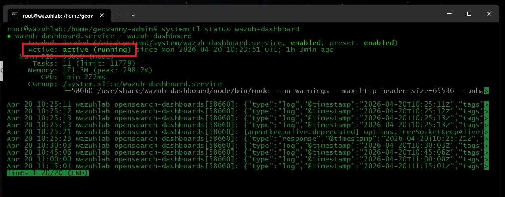
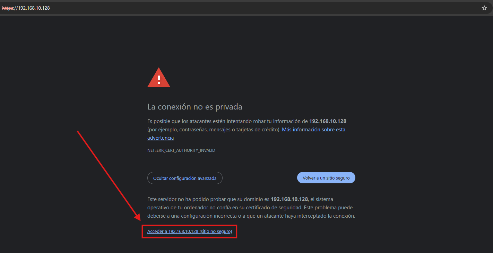
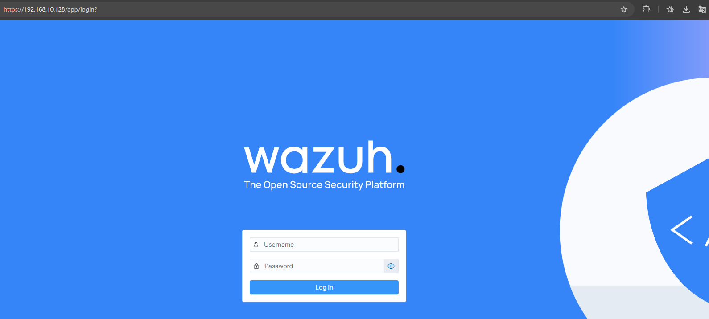
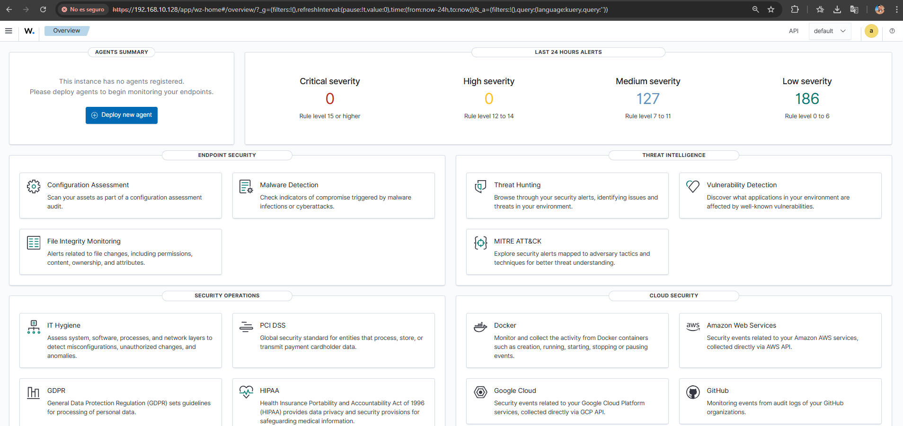
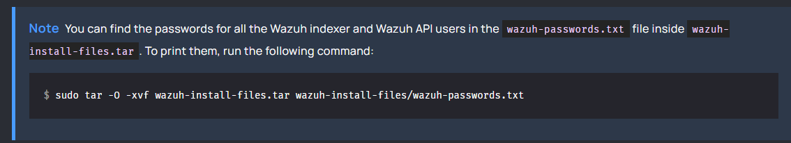
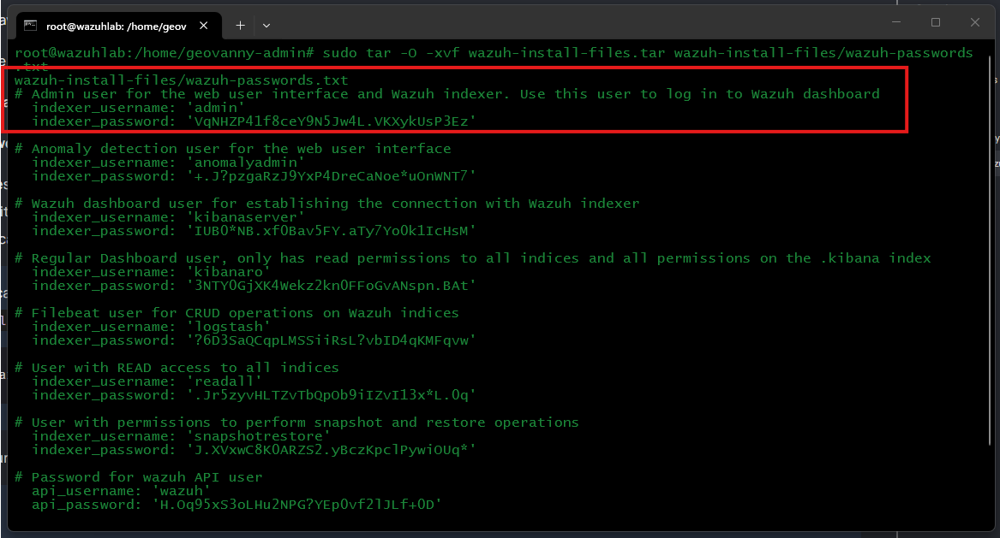

# Install Wazuh All-in-One

## Objective

For this lab, I installed the Wazuh Manager, Indexer, and Dashboard on the same Ubuntu server. An all-in-one deployment is easier to operate in a small environment and still lets me follow the complete path from log collection to alert investigation.

The installation command below reflects the version used when I built the lab. Before reproducing the setup, check the [current Wazuh Quickstart](https://documentation.wazuh.com/current/quickstart.html) in case the package URL or supported operating systems have changed.

## Wazuh Components

- **Manager:** Receives endpoint data, evaluates rules, and generates alerts
- **Indexer:** Stores the security data and makes it searchable
- **Dashboard:** Provides the web interface used for monitoring and investigation

## Installation Steps

### 1. Identify the Server Address

On the **Wazuh Ubuntu Server**, run:

```bash
ip addr
```

In this lab, the Wazuh server uses the IP address `192.168.10.128`.



### 2. Connect Through SSH

From a terminal on the **host machine**, connect using the lab administrator account:

```bash
ssh <ADMIN_USER>@<WAZUH_SERVER_IP>
```

Confirm the host fingerprint the first time you connect, then enter the Ubuntu account password.



### 3. Download and Run the Installer

The lab was installed with the Wazuh 4.14 installation assistant:

```bash
curl -sO https://packages.wazuh.com/4.14/wazuh-install.sh
sudo bash ./wazuh-install.sh -a
```

The process can take several minutes because it installs and configures all three central components.



### 4. Save the Dashboard Credentials Securely

At the end of the installation, the assistant displays the Dashboard username and password. I kept this output as part of the lab evidence because it confirms that the installation completed successfully.



### 5. Verify the Services

On the **Wazuh Ubuntu Server**, run:

```bash
sudo systemctl status wazuh-dashboard
sudo systemctl status wazuh-indexer
sudo systemctl status wazuh-manager
```

Each service should show **active (running)**.



If a service is stopped, start only the affected component:

```bash
sudo systemctl start wazuh-dashboard
sudo systemctl start wazuh-indexer
sudo systemctl start wazuh-manager
```

### 6. Open the Dashboard

From the host browser, open:

```text
https://<WAZUH_SERVER_IP>
```

A browser warning is expected because the lab uses a self-signed certificate. Confirm that the address belongs to your Wazuh server before continuing.




### 7. Sign In

Use the Dashboard credentials generated during installation.



### 8. Recover the Generated Credentials if Needed

If the original output was not saved, run this command from the directory that contains `wazuh-install-files.tar`:

```bash
sudo tar -O -xvf wazuh-install-files.tar wazuh-install-files/wazuh-passwords.txt
```

This command displays the credentials generated during the installation. For the Dashboard, use the entry labeled `Admin user for the web user interface and Wazuh indexer`.




## Expected Result

The three Wazuh services should be running and the Dashboard should be accessible through HTTPS.

---

<p align="center">
  <strong>Lab Navigation</strong>
</p>

<p align="center">
  <a href="05-Configuration-Ubuntu-Before-Install-Wazuh.md">⬅️ Previous: Configure VMware Networks</a>
  &nbsp;&nbsp;&nbsp;|&nbsp;&nbsp;&nbsp;
  <a href="07-Windows_Server_2022.md">Next: Install Windows Server 2022 ➡️</a>
</p>
