# Install Windows Server 2022

## Objective

Windows Server 2022 is the first endpoint connected to Wazuh in this lab. It gives me a Windows system where I can collect authentication, system, and security events before adding more advanced telemetry.

## Recommended Resources

| Resource | Lab configuration | Minimum |
|---|---:|---:|
| CPU | 2 vCPU | 1 vCPU |
| RAM | 8 GB | 2 GB |
| Disk | 80 GB | 60 GB |

## Create the Virtual Machine

### 1. Download Windows Server

Download the 64-bit ISO from the [Microsoft Evaluation Center](https://www.microsoft.com/es-es/evalcenter/download-windows-server-2022).

### 2. Start the VMware Wizard

In VMware Workstation, select **File > New Virtual Machine**, then choose **Typical (recommended)**.

Select **I will install the operating system later**.

### 3. Select the Guest Operating System

Choose:

- **Guest operating system:** Microsoft Windows
- **Version:** Windows Server 2022

### 4. Name the VM

Use a clear lab name, for example:

`Windows-Server-01`

### 5. Configure the Disk and Hardware

Assign an 80 GB disk and select **Store virtual disk as a single file**.

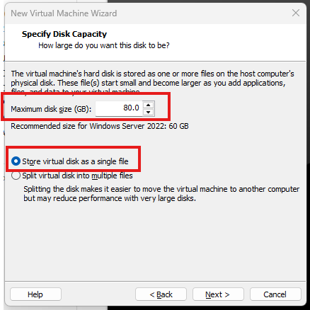
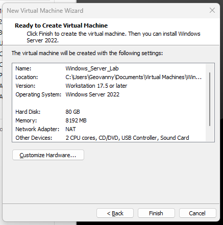

Review the CPU, memory, disk, and network adapter before selecting **Finish**.

### 6. Attach the ISO

Open **Edit virtual machine settings**.

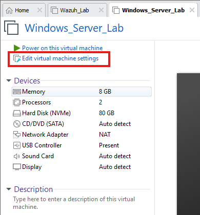

Select **CD/DVD (SATA)**, choose **Use ISO image file**, and attach the Windows Server ISO. Make sure **Connect at power on** is enabled.

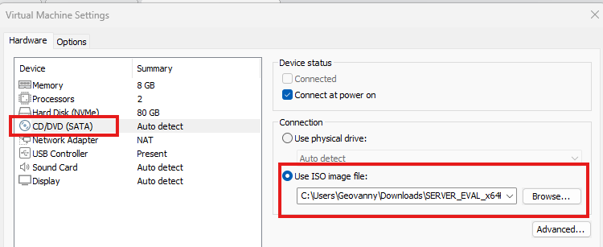

## Install Windows Server

### 7. Start the Installer

Power on the VM and press a key when prompted to boot from the ISO.

To release the mouse and keyboard from VMware, press **Ctrl + Alt**.

### 8. Select Language and Keyboard

Choose the language, time format, and keyboard layout that match your environment, then select **Install now**.

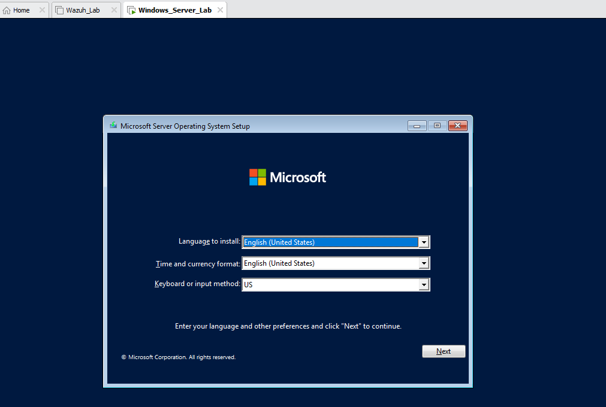

### 9. Select the Edition

For this lab, I used:

**Windows Server 2022 Standard Evaluation (Desktop Experience)**

The Desktop Experience edition includes the graphical interface, which makes the first setup easier.

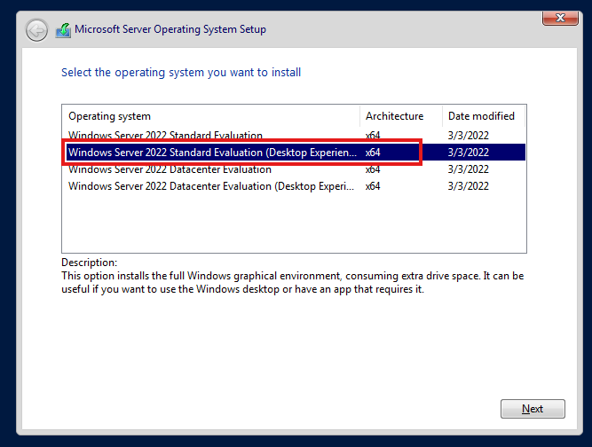

### 10. Accept the License and Select Installation Type

Accept the license terms and choose:

**Custom: Install Microsoft Server Operating System only (advanced)**

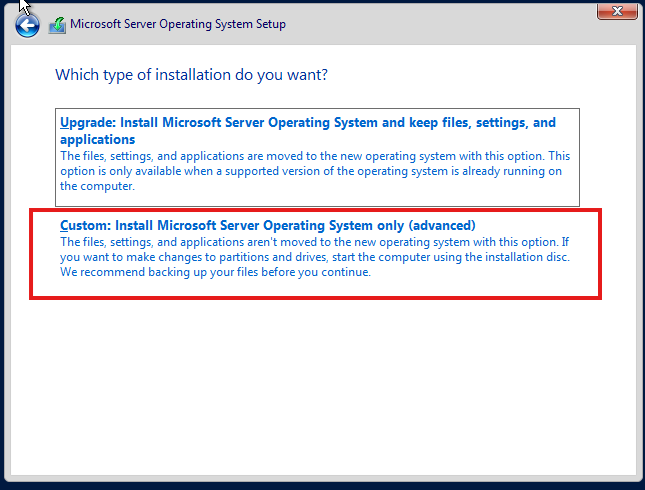

### 11. Select the Disk

Choose **Drive 0 Unallocated Space** and continue.

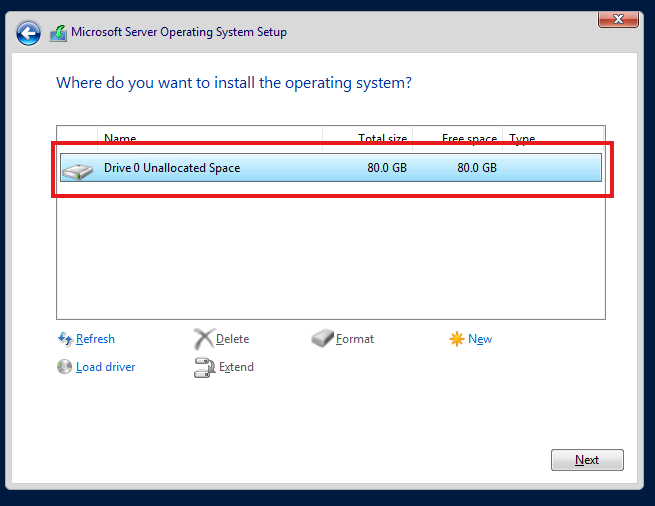

### 12. Complete the Installation

Wait while Windows copies the files and installs the operating system.

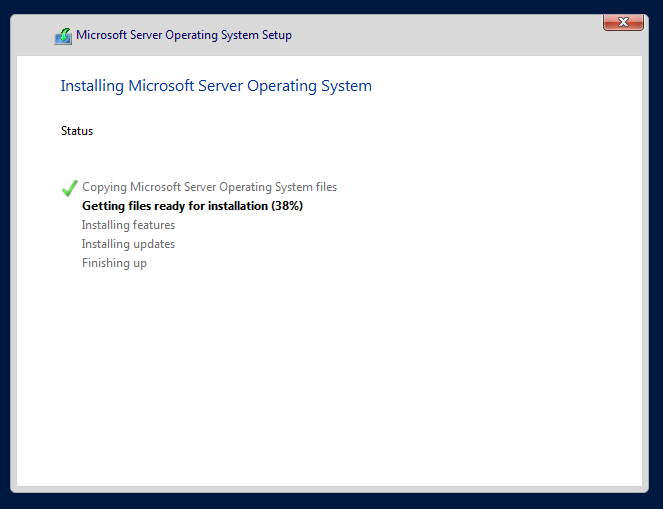

### 13. Configure the Administrator Account

After the restart, create a strong password for the built-in **Administrator** account. Keep this password out of screenshots and public documentation.

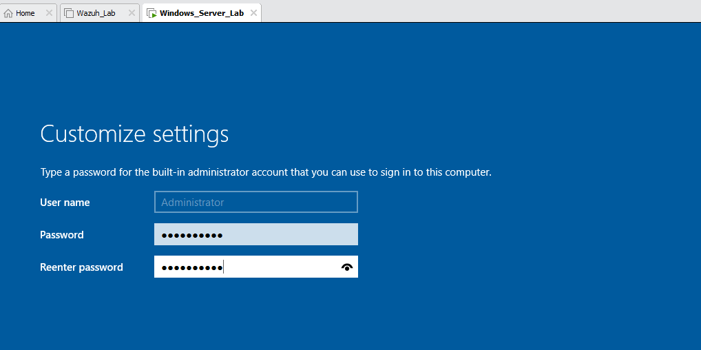

### 14. Sign In

In VMware Workstation, right-click the VM and select **Send Ctrl + Alt + Del**, then sign in as Administrator.

The Windows Server desktop should load normally.

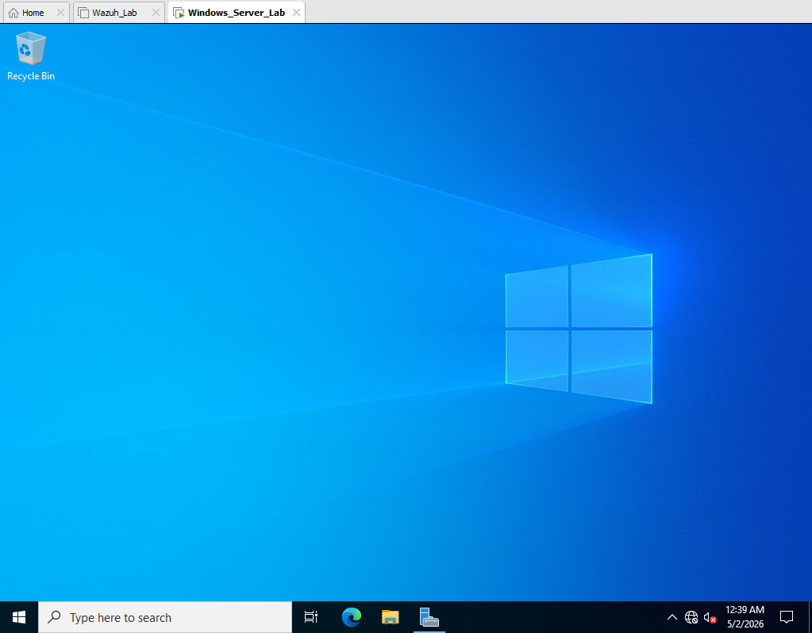

## Connect the VM to the Lab Network

Power off the VM and open:

**Edit virtual machine settings > Network Adapter**

Connect the adapter to the internal VMware network used by the Wazuh server. The two systems must be able to communicate before the agent can be registered.

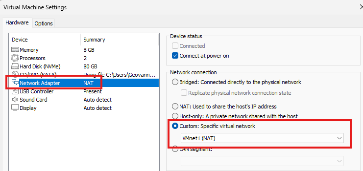

## Expected Result

Windows Server 2022 should start normally and be connected to the internal lab network. It is now ready for the Wazuh Agent installation.

---

  <strong>Lab Navigation</strong>

  <a href="06-Wazuh-Installation.md">⬅️ Previous: Install Wazuh All-in-One</a>
  &nbsp;&nbsp;&nbsp;|&nbsp;&nbsp;&nbsp;
  <a href="08-Installing-the-Wazuh-Agent-on-Windows-Server.md">Next: Install the Wazuh Agent ➡️</a>

