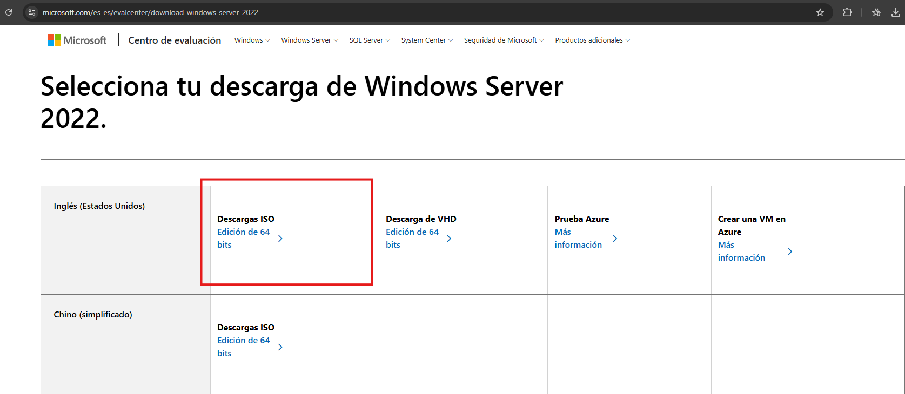
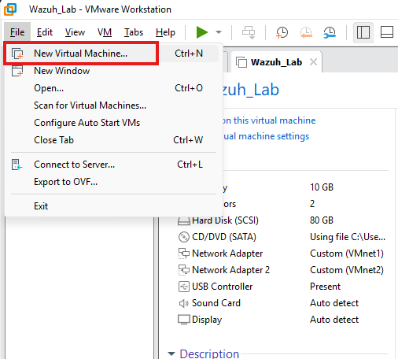
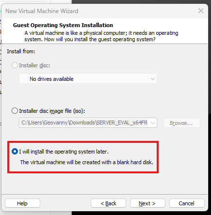
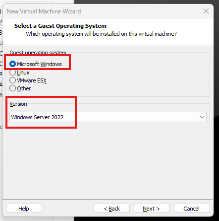
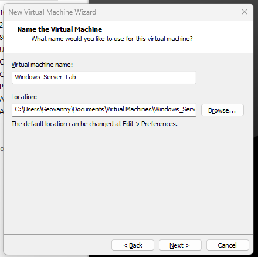

## Installing Windows Server 2022 as the First Wazuh Agent

In this section, we will create and install a Windows Server 2022 virtual machine in VMware Workstation.  
This server will be used later as our first Windows endpoint with the Wazuh Agent installed.

The goal is to simulate a small corporate environment where Wazuh can collect Windows security events, system logs, authentication events, and other endpoint activity.

---

### Step 1: Download the Windows Server 2022 ISO
First, download the Windows Server 2022 ISO image from the official Microsoft Evaluation Center.
Download link:
https://www.microsoft.com/es-es/evalcenter/download-windows-server-2022
Select the **ISO download** option and choose the **64-bit edition**.

---

### Step 2: Open VMware Workstation
Open **VMware Workstation**.
Then go to:
**File > New Virtual Machine**
This will start the wizard to create a new virtual machine.

---

### Step 3: Start the Virtual Machine Wizard
Select the option:
**Typical (recommended)**
This option is enough for this lab because we do not need advanced custom hardware settings at this stage.
Then click **Next**.

---

### Step 4: Select “I will install the operating system later”
In this step, select:
**I will install the operating system later**
This allows us to manually attach the Windows Server ISO after creating the virtual machine.
Then click **Next**.

---

### Step 5: Select the Guest Operating System

Select the following options:
- **Guest operating system:** Microsoft Windows
- **Version:** Windows Server 2022
This helps VMware apply the correct default settings for the virtual machine.
Then click **Next**.

---

### Step 6: Name the Virtual Machine

Assign a name to the virtual machine.
In this lab, the VM will be named:
**Windows_Server_Lab**
You can also choose the location where the virtual machine files will be stored.
Then click **Next**.

---

## Step 7: Configure the Virtual Disk

For this lab, we will configure the virtual disk with:

- **Disk size:** 80 GB
- **Disk type:** Store virtual disk as a single file

Recommended resources for Windows Server 2022 in this lab:

| Resource | Recommended |
|---|---|
| CPU | 2 vCPU |
| RAM | 4 GB |
| Disk | 80 GB |

Minimum resources:

| Resource | Minimum |
|---|---|
| CPU | 1 vCPU |
| RAM | 2 GB |
| Disk | 60 GB |

In this lab, I will use:

- **CPU:** 2 vCPU
- **RAM:** 8 GB
- **Disk:** 80 GB

Important note:  
Select **Store virtual disk as a single file** to keep the virtual disk in one file. This is useful for lab environments and can help with disk performance.

Then click **Next**.

---

## Step 8: Review the Virtual Machine Settings

Before creating the VM, review the configuration.

In this example, the VM is configured with:

- Windows Server 2022
- 80 GB disk
- 8 GB RAM
- 2 CPU cores
- Network Adapter enabled

If everything looks correct, click **Finish**.

---

## Step 9: Edit the Virtual Machine Settings

After creating the VM, click:

**Edit virtual machine settings**

We need to attach the Windows Server 2022 ISO file before powering on the VM.

---

## Step 10: Attach the Windows Server ISO

Go to:

**CD/DVD (SATA)**

Then select:

**Use ISO image file**

Browse and select the Windows Server 2022 ISO file that was downloaded from Microsoft.

Make sure **Connect at power on** is enabled.

Then click **OK**.

---

## Step 11: Power On the Virtual Machine

Power on the virtual machine.

When the VM starts, you may see a message similar to:

**Press any key to boot from CD or DVD**

Press any key to start the Windows Server installation from the ISO.

Important note:  
To release your mouse and keyboard from the VM, press:

**CTRL + ALT**

---

## Step 12: Select Language and Keyboard Settings

The Windows Server installation screen will appear.

Select the language, time format, and keyboard layout.

For this lab, I selected:

- **Language:** English (United States)
- **Time and currency format:** English (United States)
- **Keyboard:** US

Then click **Next**.

After that, click **Install now**.

---

## Step 13: Select the Windows Server Edition

Select the operating system edition that you want to install.

For this lab, select:

**Windows Server 2022 Standard Evaluation (Desktop Experience)**

The **Desktop Experience** version includes the graphical interface, which makes it easier to manage the server in a lab environment.

Then click **Next**.

---

## Step 14: Accept the License Terms

Read and accept the Microsoft license terms.

Then click **Next** to continue with the installation.

---

## Step 15: Select the Installation Type

Select the option:

**Custom: Install Microsoft Server Operating System only (advanced)**

This option performs a clean installation of Windows Server.

Then click **Next**.

---

## Step 16: Select the Installation Disk

Select the available disk:

**Drive 0 Unallocated Space**

This is the virtual disk created earlier in VMware.

Then click **Next**.

---

## Step 17: Wait for Windows Server to Install

Windows Server will start installing.

The installation process includes:

- Copying Windows files
- Getting files ready for installation
- Installing features
- Installing updates
- Finishing the installation

This process may take several minutes.

---

## Step 18: Create the Administrator Password

After the installation finishes, the VM will restart automatically.

When Windows Server starts for the first time, it will ask you to create a password for the built-in Administrator account.

Enter a secure password and click **Finish**.

Important note:  
The default username is:

**Administrator**

---

## Step 19: Unlock the Windows Server Login Screen

To log in to Windows Server, you need to send the following key combination:

**CTRL + ALT + DELETE**

In VMware Workstation, right-click the virtual machine and select:

**Send Ctrl + Alt + Del**

After that, enter the Administrator password.

---

## Step 20: Validate the Windows Server Desktop

After logging in, the Windows Server desktop should load successfully.

At this point, the Windows Server VM is installed and ready for the next configuration steps.

This server will later be used to install the Wazuh Agent and forward Windows logs to the Wazuh Manager.

---

## Step 21: Validate the Network Adapter

If the Windows Server VM does not have network connectivity, power off the VM and check the network settings.

Go to:

**Edit virtual machine settings > Network Adapter**

Make sure the VM is connected to the correct virtual network used in the lab.

In this lab, the VM is connected to a custom VMware network adapter.

Important note:  
Use the same network segment where the Wazuh Manager can communicate with this Windows Server. This will be required later when installing and registering the Wazuh Agent.

Then click **OK**.

---

## Final Result

At this point, the Windows Server 2022 virtual machine has been successfully installed in VMware Workstation.

This VM will be used as the first Windows endpoint in the Wazuh lab.  
The next step will be to configure the network settings, validate connectivity with the Wazuh Server, and install the Wazuh Agent.
