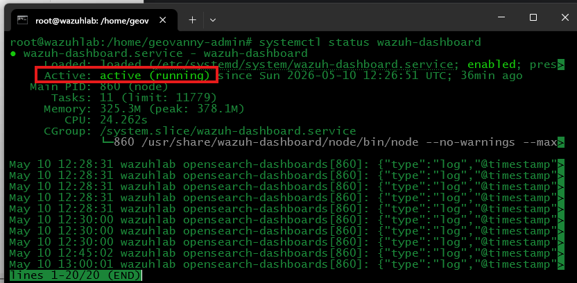
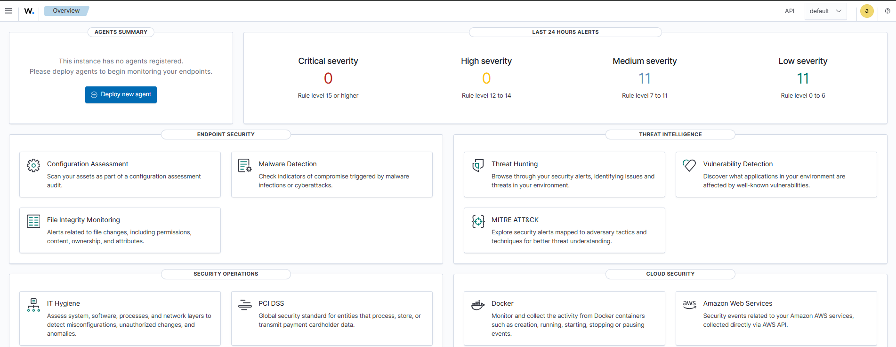
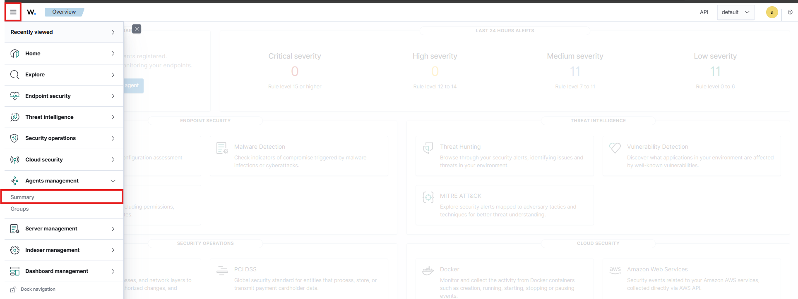
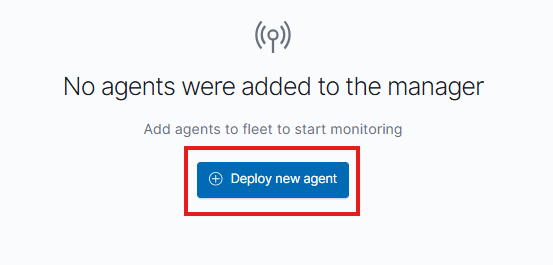
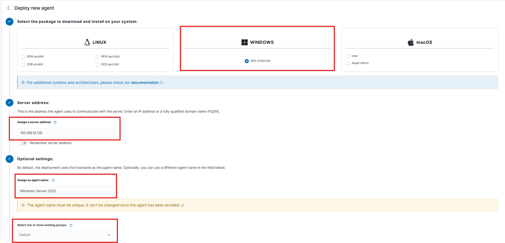
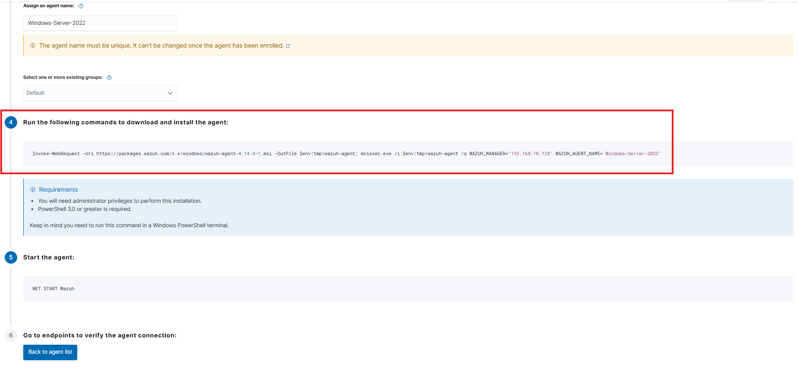
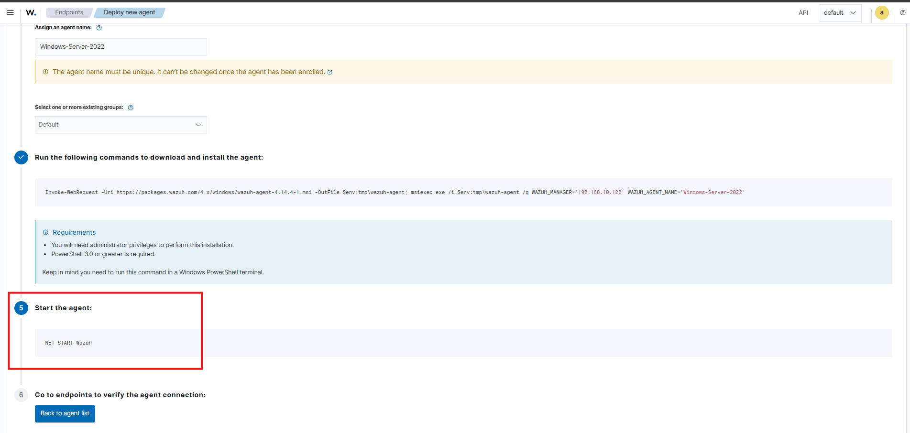
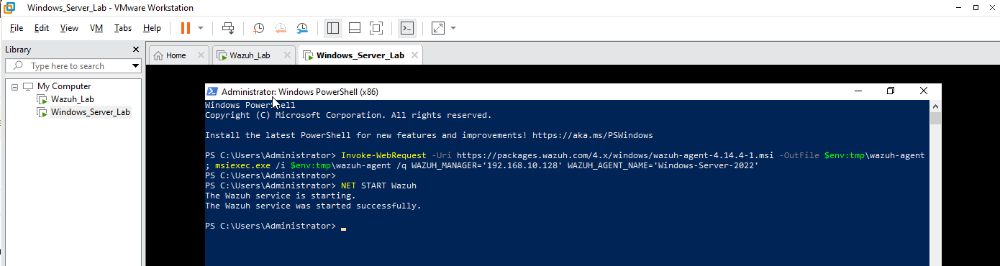
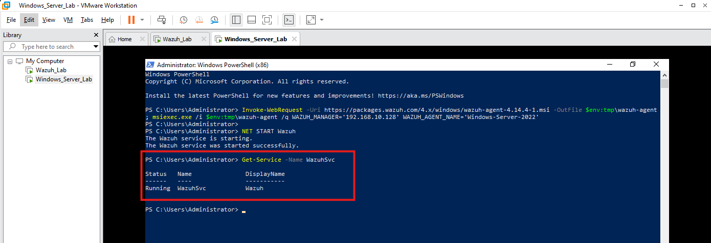
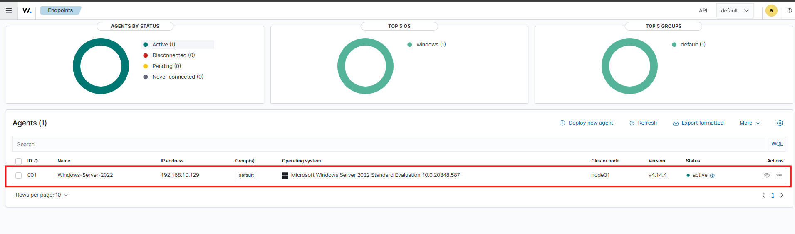

## Installing the Wazuh Agent on Windows Server 2022

In this section, we will install the Wazuh Agent on a Windows Server 2022 virtual machine, the goal is to connect the Windows Server endpoint to the Wazuh Manager so Wazuh can start collecting Windows security events, authentication logs, system logs, and endpoint activity.

---

### Step 1: Validate the Wazuh Services

First, power on the Wazuh VM, then connect to the Wazuh server using SSH. In my case, I access the server from CMD or a terminal using SSH.
Once connected, switch to the root user: **sudo su**

After entering the password, validate that the Wazuh services are running:
- systemctl status wazuh-dashboard
- systemctl status wazuh-indexer
- systemctl status wazuh-manager



All services should show the following status: **active (running)**

These services are important because:
- **Wazuh Manager:** Receives and analyzes data from the agents.
- **Wazuh Indexer:** Stores the security alerts and events.
- **Wazuh Dashboard:** Provides the web interface to review agents, alerts, and security data.

If one of the services is not running, start it manually.
Example:
- systemctl start wazuh-dashboard
- systemctl start wazuh-indexer
- systemctl start wazuh-manager

---

### Step 2: Access the Wazuh Dashboard

After validating that the Wazuh services are running, open a web browser and access the Wazuh Dashboard using the IP address of the Wazuh VM, in this lab, the Wazuh Dashboard is already accessible and working correctly.
At this point, also power on the Windows Server 2022 VM because we will install the Wazuh Agent on that endpoint.



---

### Step 3: Choose the Wazuh Agent Installation Method

There are two common ways to install the Wazuh Agent on Windows Server:

- **CLI installation:** Using PowerShell commands.
- **GUI installation:** Using the Windows installer manually.

In this lab, we will use the **CLI installation** method because it is faster, cleaner, and easier to document, I will share with you the Official Wazuh documentation:
https://documentation.wazuh.com/current/installation-guide/wazuh-agent/wazuh-agent-package-windows.html

---

### Step 4: Open the Agents Management Section

Inside the Wazuh Dashboard, click the menu icon in the upper-left corner, then go to: **gents management > Summary**
This section allows us to deploy new agents and verify the endpoints connected to the Wazuh Manager.



---

### Step 5: Deploy a New Agent

Inside the **Agents management** section, click: **Deploy new agent**, this option opens the deployment wizard, where Wazuh generates the installation command for the endpoint.



---

### Step 6: Select the Windows Agent Package

In the deployment wizard, select the Windows package: **Windows - MSI 32/64 bits**
Then configure the following values:
- Server address: 192.168.10.128
- Agent name: Windows-Server-2022
- Group: Default

Explanation:
- **Server address:** This is the IP address of the Wazuh Manager.
- **Agent name:** This is the name that will appear in the Wazuh Dashboard.
- **Group:** This is the Wazuh group where the agent will be assigned.

In this lab, the Windows Server agent will be registered as: **Windows-Server-2022**



---

## Step 7: Copy the Agent Installation Command

Scroll down until you see the command generated by Wazuh, this command downloads and installs the Wazuh Agent on Windows Server.

This command does the following:
- Downloads the Wazuh Agent installer.
- Installs the agent silently.
- Assigns the Wazuh Manager IP address.
- Registers the agent using the selected agent name.



---

## Step 8: Open PowerShell as Administrator

Go to the Windows Server VM and open **PowerShell as Administrator**, then paste the command generated by Wazuh, in VMware Workstation, if you need to paste the command into the VM, you can use: **Edit > Paste**
Then press **Enter** to execute the installation command.


---

## Step 9: Start the Wazuh Agent Service

After the installation finishes, return to the Wazuh Dashboard and copy the second command shown in the deployment wizard, this command starts the Wazuh Agent service on Windows Server:
Run the command in **PowerShell as Administrator**.



---

## Step 10: Confirm the Agent Started Successfully

After running the command, PowerShell should show that the Wazuh service started successfully, this means the Wazuh Agent service is now running on the Windows Server VM.



---

## Step 11: Validate the Wazuh Agent Service

To confirm that the Wazuh Agent is running correctly, execute the following command on the Windows Server VM:
```powershell
Get-Service -Name WazuhSvc
```


---

## Step 12: Verify the Agent in Wazuh Dashboard

Go back to the Wazuh Dashboard, then navigate to: **Agents management > Summary**
The Windows Server should now appear in the agent list, and should be Active

This confirms that the Windows Server is successfully connected to the Wazuh Manager.



---

## Final Result

At this point, the Wazuh Agent has been successfully installed on Windows Server 2022.

The Windows Server endpoint is now connected to the Wazuh Manager and visible in the Wazuh Dashboard.

Wazuh can now start collecting security data from the Windows endpoint, such as:

- Windows login events
- Authentication activity
- System events
- Security logs
- Agent status
- Endpoint monitoring data

The next step will be to validate Windows log collection and review security events inside the Wazuh Dashboard.
