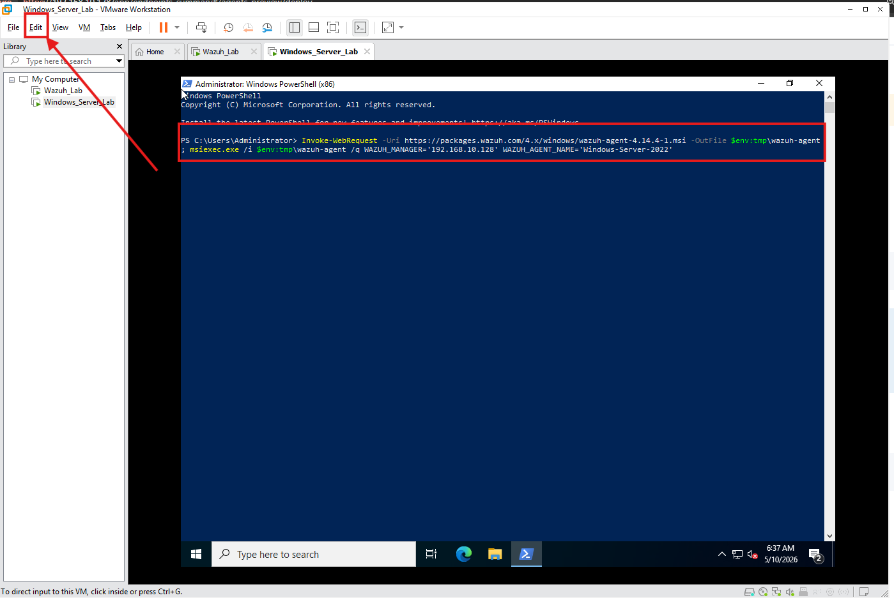

# Install the Wazuh Agent on Windows Server

## Objective

The Wazuh Agent sends endpoint data from Windows Server to the Wazuh Manager. This step connects the first monitored machine and confirms that the central components can receive agent information.

## Before You Begin

Make sure:

- The Wazuh server and Windows Server are running
- Both machines are connected to the same internal lab network
- Windows Server can reach the Wazuh Manager
- The Wazuh Manager, Indexer, and Dashboard services are active

On the **Wazuh Ubuntu Server**, you can verify the services with:

```bash
sudo systemctl status wazuh-manager
sudo systemctl status wazuh-indexer
sudo systemctl status wazuh-dashboard
```


## Deploy the Agent

### 1. Open the Wazuh Dashboard

Open the Dashboard from the host browser and sign in.


### 2. Open Agent Management

Go to:

**Agents management > Summary**


Select **Deploy new agent**.


### 3. Configure the Deployment

Select **Windows MSI 32/64 bits** and provide:

- **Server address:** The internal IP address of the Wazuh Manager
- **Agent name:** A fictional, descriptive hostname such as `win-server-01`
- **Group:** `default`, unless you have created a separate lab group


The Dashboard generates an installation command using the values entered in the wizard.

### 4. Install the Agent

Copy the generated command.


On the **Windows Server VM**, open **PowerShell as Administrator**, paste the command, and run it.



The command downloads the MSI package, installs the agent silently, and configures the Wazuh Manager address and agent name.

### 5. Start the Service

Run the service command shown by the deployment wizard from the same elevated PowerShell window.


### 6. Validate the Windows Service

On the **Windows Server VM**, run:

```powershell
Get-Service -Name WazuhSvc
```

The service status should be **Running**.


### 7. Confirm the Agent in Wazuh

Return to **Agents management > Summary**. The Windows endpoint should appear with an **Active** status.


## Expected Result

The Windows Server endpoint should be visible as an active agent in the Wazuh Dashboard. At this stage, the connection is working; additional Windows and Sysmon telemetry will be configured in the Detection Engineering phase.

---

<p align="center">
  <strong>Lab Navigation</strong>
</p>

<p align="center">
  <a href="07-Windows_Server_2022.md">⬅️ Previous: Install Windows Server 2022</a>
  &nbsp;&nbsp;&nbsp;|&nbsp;&nbsp;&nbsp;
  <a href="09-Install-Kali-Linux.md">Next: Install Kali Linux ➡️</a>
</p>
