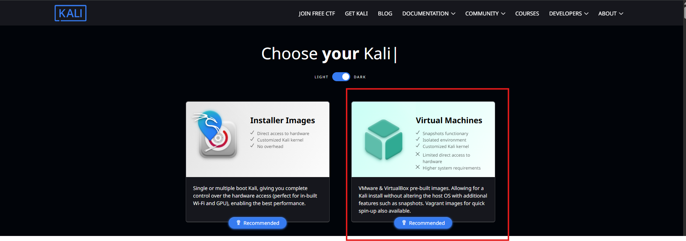
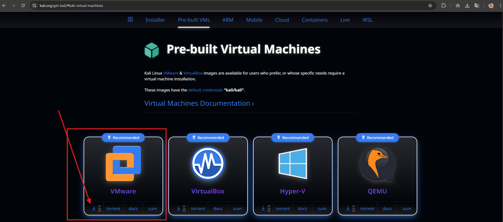
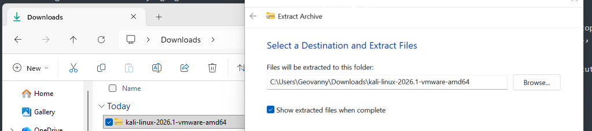
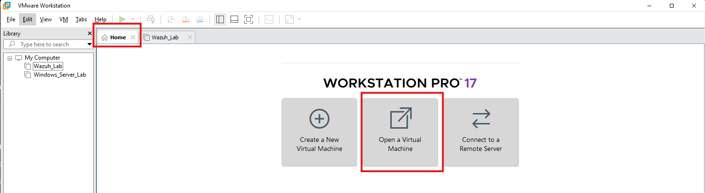
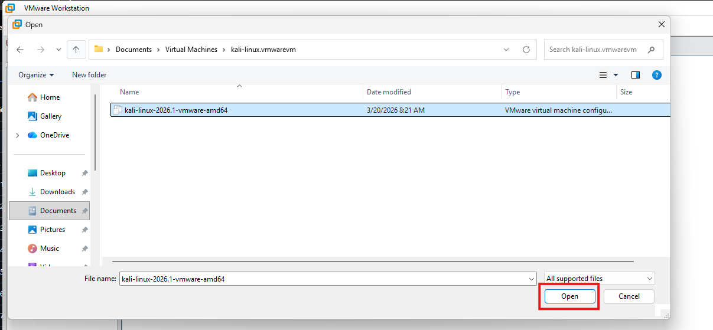
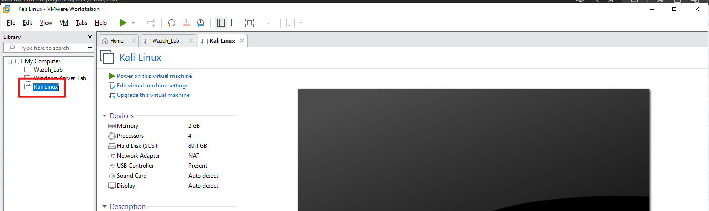

# Install Kali Linux

## Objective

Kali Linux is the testing machine in this lab. I use it to generate controlled network and authentication activity so I can confirm whether Wazuh receives the expected logs and triggers the correct detections.

All testing should remain inside the isolated lab network.

## Import the Kali Virtual Machine

### 1. Download the VMware Image

Go to the [official Kali Linux download page](https://www.kali.org/get-kali/#kali-virtual-machines), select **Virtual Machines**, and download the VMware image.




Using the prebuilt image avoids a separate operating system installation.

### 2. Extract the Download

Extract the compressed file and wait until the process finishes. The new folder should contain the VMware configuration and virtual disk files.



### 3. Organize the VM Files

Move the extracted folder to the location where you keep the other lab machines. I renamed the folder to `Kali-Linux` to keep the environment easy to identify.

In VMware Workstation, select **Open a Virtual Machine**.



### 4. Import the VM

Open the extracted folder, select the VMware configuration file, and choose **Open**.



Rename the machine in VMware if needed.



### 5. Review the Hardware and Network

Before starting Kali, review the CPU, RAM, disk, and network adapter.

Connect Kali to the same **Host-Only** network used by the monitored endpoints. Add temporary NAT access only when Kali needs updates or packages.

### 6. Start Kali Linux

Power on the VM and wait for the login screen.

Kali images may ship with the default credentials:

- **Username:** `kali`
- **Password:** `kali`

Change the default password immediately:

```bash
passwd
```

Do not publish the new password.

### 7. Verify Lab Connectivity

From the **Kali Linux VM**, verify that the Wazuh server and monitored endpoint are reachable:

```bash
ip addr
ping -c 4 <WAZUH_SERVER_IP>
ping -c 4 <WINDOWS_SERVER_IP>
```

## Expected Result

Kali Linux should start normally, use a non-default password, and communicate with the other machines through the isolated lab network. It is now ready for controlled detection tests.

---

<p align="center">
  <strong>Lab Navigation</strong>
</p>

<p align="center">
  <a href="08-Installing-the-Wazuh-Agent-on-Windows-Server.md">⬅️ Previous: Install the Wazuh Agent</a>
  &nbsp;&nbsp;&nbsp;|&nbsp;&nbsp;&nbsp;
  <a href="01-Lab_Overview.md">Back to Lab Overview 🔄</a>
</p>
